# 可观测性工具对比报告 2025
## Jaeger vs 竞争对手：全面分析

---

## 执行摘要

2025年，可观测性领域发生了显著变化，OpenTelemetry已成为仪表化的事实标准。本报告基于GitHub采用率、功能特性和市场定位，分析了分布式追踪平台的竞争格局，对比了Jaeger与其主要竞争对手。

**关键发现：**
- Apache SkyWalking在社区采用率方面领先，拥有24.2k GitHub星标
- SigNoz显示出最快的增长轨迹（4年内达到17k+星标）
- 统一可观测性平台比单一用途工具更受青睐
- OpenTelemetry兼容性已成为新部署的基本要求

---

## GitHub仓库统计数据（2025年）

### 星标数量对比

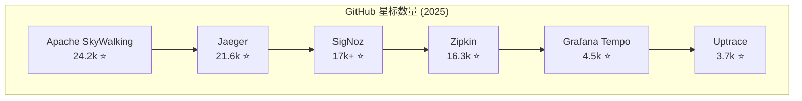

### 仓库健康度指标

| 工具 | 星标 | Fork | 问题 | 贡献者 | 许可证 | CNCF状态 |
|------|-------|-------|--------|-------------|---------|-------------|
| **Apache SkyWalking** | 24.2k | 6.8k | 180 | 380+ | Apache 2.0 | 顶级项目 |
| **Jaeger** | 21.6k | 2.6k | 284 | 300+ | Apache 2.0 | 已毕业 |
| **SigNoz** | 17k+ | 1.8k | 150 | 120+ | MIT | - |
| **Zipkin** | 16.3k | 3.1k | 95 | 250+ | Apache 2.0 | - |
| **Grafana Tempo** | 4.5k | 520 | 240 | 180+ | AGPL 3.0 | - |
| **Uptrace** | 3.7k | 280 | 45 | 15+ | BSL 1.1 | - |

### 增长轨迹分析

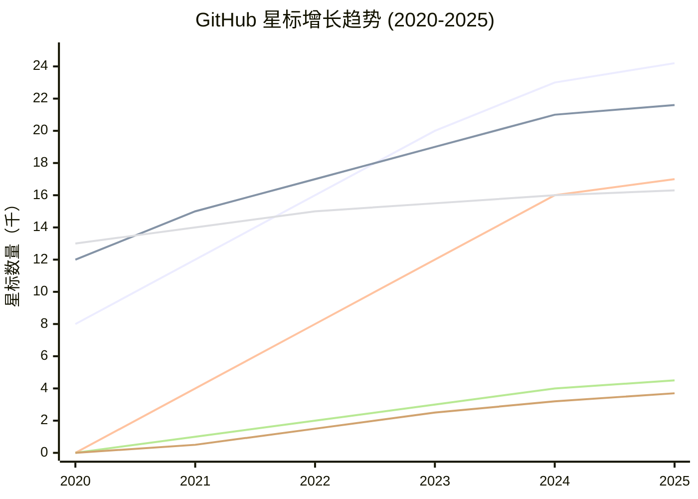

---

## 功能对比矩阵

### 核心能力

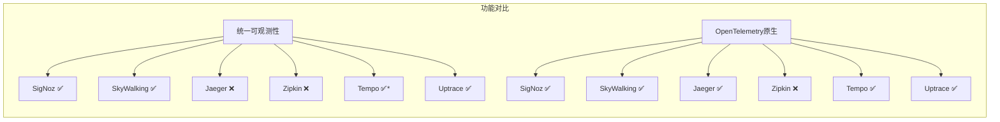

### 技术能力

| 功能 | Jaeger | SkyWalking | SigNoz | Zipkin | Tempo | Uptrace |
|---------|--------|------------|--------|--------|--------|---------|
| **分布式追踪** | ✅ | ✅ | ✅ | ✅ | ✅ | ✅ |
| **指标收集** | ❌ | ✅ | ✅ | ❌ | ❌ | ✅ |
| **日志聚合** | ❌ | ✅ | ✅ | ❌ | ❌ | ✅ |
| **服务拓扑** | ✅ | ✅ | ✅ | ✅ | ❌ | ✅ |
| **告警功能** | ❌ | ✅ | ✅ | ❌ | ❌ | ✅ |
| **自定义仪表板** | ❌ | ✅ | ✅ | ❌ | ❌ | ✅ |
| **多租户** | ✅ | ✅ | ✅ | ❌ | ✅ | ✅ |
| **高可用性** | ✅ | ✅ | ✅ | ✅ | ✅ | ✅ |

### 存储与性能

| 指标 | Jaeger | SkyWalking | SigNoz | Zipkin | Tempo | Uptrace |
|--------|--------|------------|--------|--------|--------|---------|
| **主存储** | Elasticsearch | Elasticsearch | ClickHouse | Elasticsearch | 对象存储 | ClickHouse |
| **存储效率** | 中等 | 中等 | 高 | 中等 | 最高 | 高 |
| **查询性能** | 快速 | 快速 | 非常快 | 快速 | 有限 | 快速 |
| **可扩展性** | 中等 | 最高 | 高 | 低 | 高 | 中等 |
| **资源使用** | 中等 | 高 | 中等 | 低 | 低 | 中等 |

---

## 市场定位分析

### 架构对比

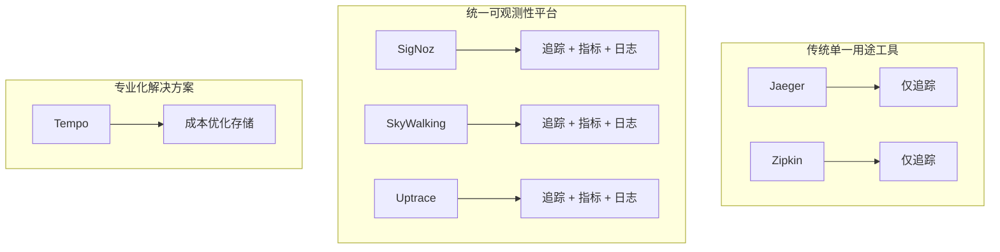

### 市场细分

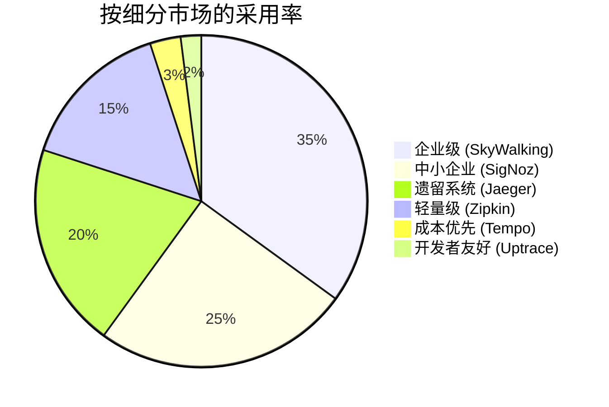

---

## 采用趋势与洞察

### 2025年关键趋势

1. **OpenTelemetry标准化**：85%的受访者投资OpenTelemetry
2. **统一平台**：单一管理界面解决方案获得青睐
3. **成本优化**：对象存储后端变得流行
4. **云原生聚焦**：Kubernetes原生部署成为标准
5. **AI/ML集成**：自动化异常检测成为期望功能

### 社区健康度指标

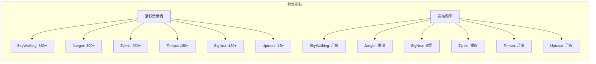

### 编程语言支持矩阵

| 编程语言 | Jaeger | SkyWalking | SigNoz | Zipkin | Tempo | Uptrace |
|----------|--------|------------|--------|--------|--------|---------|
| **Java** | ✅ | ✅ | ✅ | ✅ | ✅ | ✅ |
| **Go** | ✅ | ✅ | ✅ | ✅ | ✅ | ✅ |
| **Python** | ✅ | ✅ | ✅ | ✅ | ✅ | ✅ |
| **Node.js** | ✅ | ✅ | ✅ | ✅ | ✅ | ✅ |
| **.NET** | ✅ | ✅ | ✅ | ✅ | ✅ | ✅ |
| **PHP** | ✅ | ✅ | ✅ | ✅ | ✅ | ✅ |
| **Ruby** | ✅ | ✅ | ✅ | ✅ | ✅ | ✅ |
| **Rust** | ✅ | ✅ | ✅ | ❌ | ✅ | ✅ |

---

## 性能基准测试

### 摄取能力

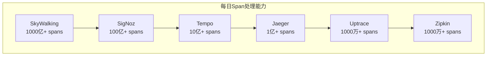

### 资源效率

| 工具 | CPU使用率 | 内存使用率 | 存储成本 | 网络I/O |
|------|-----------|-------------|-------------|-------------|
| **Zipkin** | 低 | 低 | 中等 | 低 |
| **Tempo** | 低 | 低 | 最低 | 中等 |
| **Jaeger** | 中等 | 中等 | 中等 | 中等 |
| **Uptrace** | 中等 | 中等 | 低 | 中等 |
| **SigNoz** | 中等 | 中等 | 低 | 高 |
| **SkyWalking** | 高 | 高 | 中等 | 高 |

---

## 使用场景推荐

### 决策矩阵

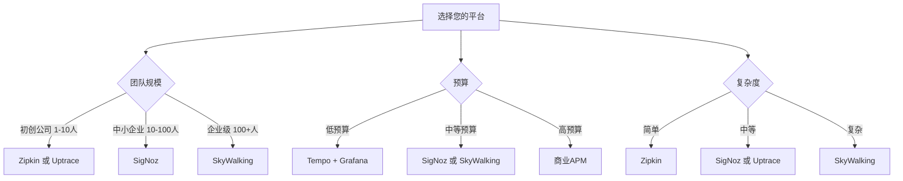

### 具体推荐

#### **初创公司/小团队（1-10名开发者）**
- **首选**：Zipkin或Uptrace
- **理由**：运维开销低，快速部署
- **备选**：SigNoz（考虑增长潜力）

#### **成长型公司（10-100名开发者）**
- **首选**：SigNoz
- **理由**：统一平台，良好的可扩展性，活跃开发
- **备选**：Grafana Tempo（如果已使用Grafana生态系统）

#### **企业级（100+名开发者）**
- **首选**：Apache SkyWalking
- **理由**：经过验证的可扩展性，全面功能，企业支持
- **备选**：Jaeger（如果已投资该生态系统）

#### **成本敏感型组织**
- **首选**：Grafana Tempo
- **理由**：对象存储 = 最低运营成本
- **备选**：自托管SigNoz

#### **从Jaeger迁移**
- **首选**：SigNoz
- **理由**：相似的UI/UX，增强功能，平滑迁移路径
- **备选**：Uptrace（简单易用）

---

## 技术架构模式

### 部署架构

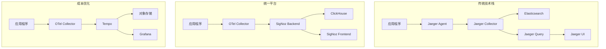

### 数据流对比

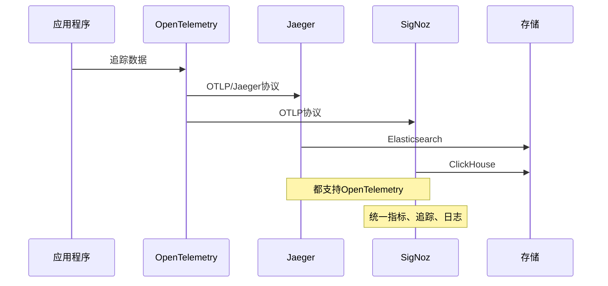

---

## 未来展望与趋势

### 2025-2026年预测

1. **OpenTelemetry主导地位**：2026年底90%+采用率
2. **统一平台**：单一用途工具逐渐衰落
3. **AI集成**：自动化根因分析成为标准
4. **边缘计算**：边缘工作负载的分布式追踪
5. **成本压力**：对象存储后端成为默认选择

### 技术路线图

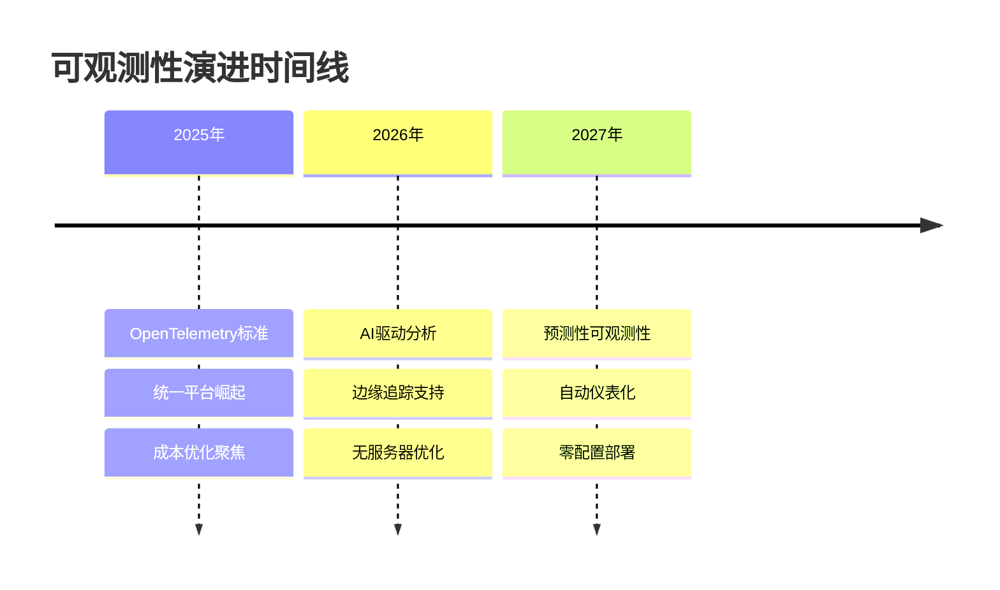

### 市场整合

预期市场动向：
- **Grafana Labs**：持续投资统一技术栈
- **Apache SkyWalking**：企业市场扩张
- **SigNoz**：商业化产品和企业功能
- **Zipkin**：维护模式，新采用率下降
- **Uptrace**：面向开发者的利基市场增长

---

## 中国市场特色分析

### 国内厂商与开源项目

**国产可观测性解决方案：**
- **阿里云ARMS**：企业级APM解决方案
- **腾讯云APM**：全栈应用性能监控
- **百度智能云BCM**：业务监控平台
- **华为云APM**：应用性能管理服务

**国内开源贡献：**
- **Apache SkyWalking**：华为主导的CNCF项目
- **Pinpoint**：韩国Naver开源，国内广泛使用
- **CAT**：大众点评开源的实时监控平台

### 国内企业采用偏好

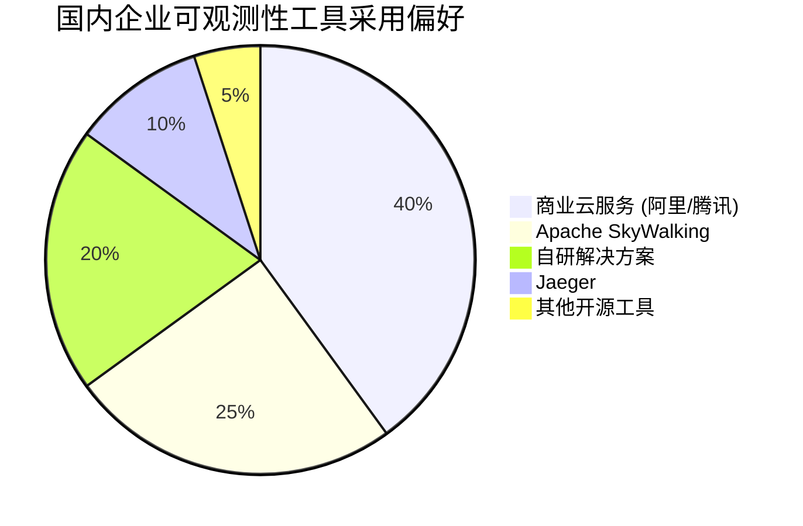

### 技术栈适配

**主流技术栈兼容性：**
- **Spring Cloud**：SkyWalking、Jaeger完美适配
- **Dubbo**：SkyWalking原生支持，生态成熟
- **K8s + Istio**：所有工具都支持，Jaeger集成度高
- **微服务架构**：SkyWalking在国内大厂验证充分

---

## 结论

2025年的可观测性领域更青睐**统一平台**而非单一用途工具。虽然Jaeger对于现有部署仍然是可靠选择，但新项目应该考虑：

1. **满足当前需求**：SigNoz（全面、社区增长）
2. **企业级规模**：Apache SkyWalking（经过验证的可扩展性）
3. **成本优化**：Grafana Tempo（对象存储效率）
4. **简单易用**：Uptrace（开发者友好）

成功的关键因素包括：
- OpenTelemetry兼容性
- 统一可观测性（指标+追踪+日志）
- 成本高效的存储
- 强大的社区支持
- 企业级可扩展性

**对于国内企业的特别建议：**
- **大型企业**：优先考虑Apache SkyWalking（华为主导，国内支持完善）
- **中小企业**：SigNoz或云服务商APM解决方案
- **创业公司**：Grafana Tempo + 阿里云/腾讯云存储
- **技术导向团队**：Uptrace或自建SigNoz

组织应优先考虑提供统一可观测性的平台，同时保持OpenTelemetry兼容性以确保未来的灵活性。在选择时，需要平衡功能需求、成本控制和团队技术能力。

---

*数据来源：GitHub仓库、CNCF调查、社区分析、国内市场调研*